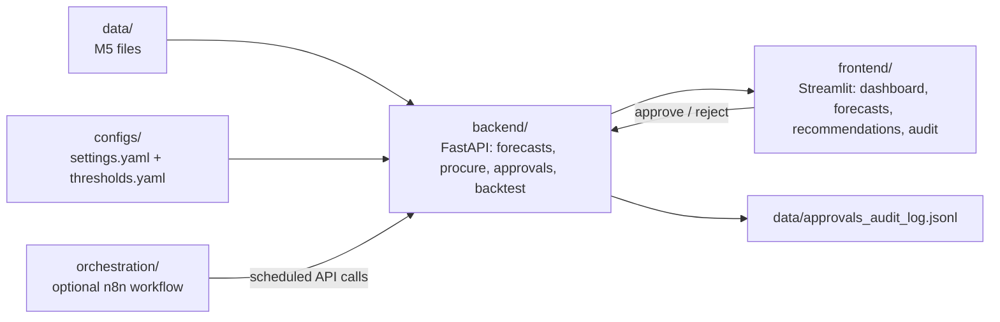

# Agentive Inventory

File-backed inventory planning demo built around the Walmart M5 dataset, with a FastAPI backend for forecasting, reorder guidance, approvals, backtests, and a Streamlit review UI.

The repo is structured as a human-in-the-loop loop: load demand history, forecast it, convert that forecast into reorder guidance, and record approve/reject decisions.

<!-- README_SURFACE_START -->
  

[](https://adredes-weslee.github.io/ai-ops/forecasting/operations/2026/03/23/human-in-the-loop-inventory-planning.html)



## Quickstart

```bash
cp .env.example .env
docker compose up --build
# UI: http://localhost:8501 | API docs: http://localhost:8000/docs
```

See [Setup and Run](#setup-and-run) for the full environment and verification path.

<!-- README_SURFACE_END -->

## Why This Repository Exists

- Inventory teams need a repeatable way to turn historical sales into reorder decisions without treating the model as a black box.
- The code applies guardrails around service level, spend, and GMROI before a recommendation can be auto-approved.
- Backtesting is built in so users can inspect forecast behavior instead of trusting a single output.

## Architecture at a Glance

- The FastAPI app under `/api/v1` exposes health, data validation, catalog IDs, forecasts, backtest, procurement, config, approvals, and metrics routes.
- Middleware adds optional bearer auth, per-IP rate limiting, JSON request logs, and Prometheus metrics.
- Forecasting lazily loads M5 sales/calendar/price data, buckets SKUs into A/B/C demand classes, prefers `xgb`/`prophet`/`sma` with fallback by availability and history length, and caches model artifacts under `data/models`.
- Procurement uses EOQ/ROP logic plus a GMROI proxy and marks recommendations for approval when thresholds or budget constraints are breached.
- The Streamlit client is a thin REST wrapper with pages for Dashboard, Forecasts, Recommendations, Settings, Backtest, and Audit Log, plus a sidebar API token field.
- State is file-backed: configs are YAML, approvals are JSONL, model cache is local disk, and `DB_URL`/`sqlmodel` exist but are not wired into runtime persistence.
- Docker Compose, the n8n example workflow, and `render.yaml` cover local orchestration and deployment wiring; n8n is commented out in the Render config.

## Repository Layout

- `backend/`
- `configs/`
- `data/`
- `frontend/`
- `orchestration/`
- `.env.example`
- `.gitattributes`
- `.gitignore`
- `docker-compose.yml`
- `environment.yml`
- `pyproject.toml`
- `README.md`
- `render.yaml`

## Setup and Run

1. The repo includes the M5 input files under `data/`; the active loaders prefer Parquet when present, and the API paths primarily use the validation, calendar, and price files.
2. Docker path: copy `.env.example` to `.env`, run `docker compose up --build`, and use the UI on `:8501`, API docs on `:8000/docs`, metrics on `:8000/metrics`, and n8n on `:5678`. In Compose, `N8N_API_URL` should target the backend API, not the n8n UI.
3. Local path: create and activate the Conda env from `environment.yml`; it now includes `pyarrow`, which keeps the parquet-preferred loaders usable on a fresh clone. Then start `uvicorn backend.app.main:app --reload --port 8000 --env-file .env` and run `streamlit run frontend/app.py` with `API_URL=http://localhost:8000/api/v1`.
4. CI already installs the service requirements and runs Ruff, mypy, and pytest on Python 3.11.

## Core Workflows

- Forecast a SKU: pick an M5 row ID from `/catalog/ids`, request `/forecasts/{sku_id}`, and inspect mean, lower/upper bounds, model, and confidence.
- Generate reorder guidance: call `/procure/recommendations`, review `order_qty`, `reorder_point`, `gmroi_delta`, and `requires_approval`, optionally request `/procure/recommendations/explain`, then approve or reject via `/approvals`.
- Run batch guidance under budget: submit `sku_ids` with optional `cash_budget`; the service ranks by `gmroi_delta` and marks selected rows.
- Evaluate model behavior: use `/backtest/{sku_id}` with `window`, `horizon`, `step`, and `model`; the API also supports `detail=true` and `cv=store|category`, and the UI shows a history overlay and coverage tables.
- Review audit and settings: `/approvals/audit-log` shows approval history, and `/configs/*` reads or writes the YAML settings and thresholds files.
- Automation loop: the included n8n example schedules a daily forecast, computes recommendations, can add an explanation step, notifies an approver, and posts approval decisions back to the API.

## Known Limitations

- This is not connected to live inventory or order systems: it reads local M5 files, and `get_current_inventory` is a stub that returns `0`.
- Approval, config, and model state are file-backed only; there is no active database persistence path despite `DB_URL` and `sqlmodel` being present.
- The Settings page exposes model portfolio controls, but the backend config schema does not accept `model_A`, `model_B`, or `model_C`, and the forecasting service still uses its own hard-coded A/B/C portfolio.
- The explanation endpoint is disabled by default when `GEMINI_API_KEY` is unset, returning `404` unless fallback mode is explicitly enabled.
- The n8n workflow is a sample, not production automation, and the Render config leaves n8n commented out.
- Forecast and backtest requests still depend on the M5 calendar horizon and required files being present, so missing data or an overlong horizon will fail the API.
